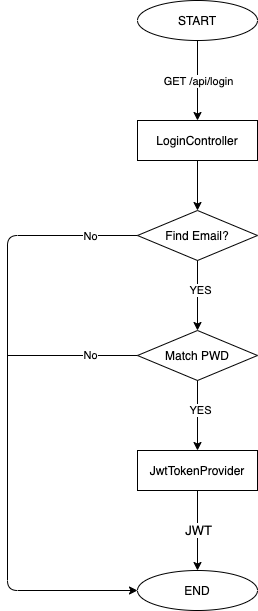
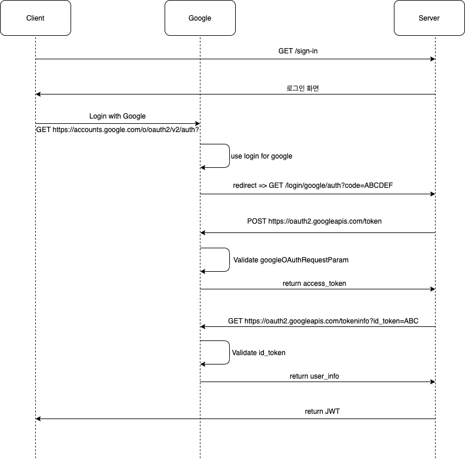
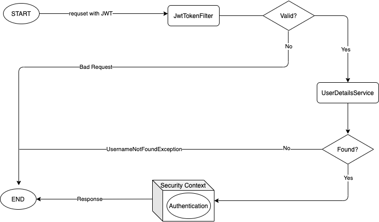

# Login-Base-Token [](https://opensource.org/licenses/MIT) [](https://travis-ci.org/ber01/Login-Base-Token) [](https://coveralls.io/github/ber01/Login-Base-Token)
자주 사용되는 로그인, 회원가입 기능에 대한 베이스 코드를 작성한 뒤 향후 프로젝트에 적용하기 위해 만든 저장소입니다.

# 목차

- [주요 기능](#주요-기능)
- [폴더 구조](#폴더-구조)
- [API 소개](#api-소개)
- [데이터베이스 스키마](#데이터베이스-스키마)
- [실행방법](#실행방법)
- [개발환경](#개발환경)
- [개선할점](#개선할점)

# 주요 기능

1. `Credential` 로그인 구현

   

2. `Google` 로그인 구현

   

3. `Request` 를 아래와 같은 순서도로 동작하게 구현

   

4. `profile` 을 이용한 개발 환경과 운영 환경 분리

# 폴더 구조
```
.
├── java
│   └── me
│       └── kyunghwan
│           └── jwt
│               ├── App.java
│               ├── IndexController.java
│               ├── LoginController.java
│               ├── LogoutController.java
│               ├── account
│               │   ├── Account.java
│               │   ├── AccountAdapter.java
│               │   ├── AccountController.java
│               │   ├── AccountRepository.java
│               │   ├── AccountService.java
│               │   └── dto
│               │       └── AccountDTO.java
│               ├── config
│               │   ├── AppConfig.java
│               │   └── SecurityConfig.java
│               ├── jwt
│               │   ├── JwtExpireToken.java
│               │   ├── JwtExpireTokenRepository.java
│               │   ├── JwtTokenFilter.java
│               │   └── JwtTokenProvider.java
│               └── oauth
│                   ├── OAuthController.java
│                   └── dto
│                       ├── GoogleOAuthRequest.java
│                       └── GoogleOAuthResponse.java
└── resources
    ├── application.yml
    └── templates
        └── sign-in.html


```
# API 소개

https://ksyj8256.gitbook.io/login-base-token-api/

# 데이터베이스 스키마

개발환경에서는 `H2` 를 운영환경에서는 `MySQL` 를 사용하였습니다. 이에 따른 설정파일 세팅 방법은 [아래](#실행방법)를 참고하세요.

## Account

|   필드   |     타입     | NULL |   KEY   | DESC |
| :------: | :----------: | :--: | :-----: | :--: |
|   IDX    |  bigint(20)  |  NO  | Primary | PK |
|  EMAIL   | varchar(255) |  NO  | Unique  | 이메일 |
|   NAME   | varchar(255) | YES  |    -    | 이름 |
| PASSWORD | varchar(255) |  NO  |    -    | 비밀번호 |
| PICTURE  | varchar(255) | YES  |    -    | 프로필 이미지 |

## Jwt Expire Token

|   필드   |     타입     | NULL |   KEY   | DESC |
| :------: | :----------: | :--: | :-----: | :--: |
|   IDX    |  bigint(20)  |  NO  | Primary | PK |
|  EXPIRE_DATE  | datetime(6) |  NO  | - | 만료 시간 |
|   JWT_TOKEN   | varchar(255) | NO |    -    | 만료된 토큰 |


# 실행방법

1. [구글 클라우드 플랫폼](https://github.com/ber01/Login-Base-Session/blob/master) 에서 **클라이언트 ID** 와 **클라이언트 보안 비밀** 을 발급받는다.

2. 사용자 인증 정보 → 승인된 리디렉션 URI 에 http://localhost:8080/login/google/auth 를 추가한다.

3. `/src/main/resources/application-oauth.yml` 을 아래와 같이 작성한다.

   ```
   spring:
     datasource:
       url: jdbc:mysql://127.0.0.1:3306/데이터베이스명?serverTimezone=Asia/Seoul
       username: 아이디
       password: 비밀번호
       driver-class-name: com.mysql.cj.jdbc.Driver
     jpa:
       hibernate:
         ddl-auto: create
       show-sql: true
       generate-ddl: true
     security:
       oauth2:
         client:
           registration:
             google:
               client-id: 구글 클라이언트 ID
               client-secret: 구글 클라이언트 보안 비밀
               scope: profile,email
   
   server:
     port: ${PORT:8080}
     error:
       whitelabel:
         enabled: false
   
   redirect-url: http://localhost:8080/login/google/auth
   ```

## IDE 

```
File → New → Project From Version Control
```

```
URL : https://github.com/ber01/Spring-Security-Login-Skeleton.git → CLONE
```

프로젝트 로딩이 끝나면 `App.java` 클래스를 실행한다.

## Gradle 

```
$ ./gradlew clean build
```

```
$ ./gradlew bootrun
```

# 개발환경

|     도구     |              버전               |
| :----------: | :-----------------------------: |
|    Spring    |    Spring Boot 2.3.4.RELEASE    |
|      OS      |            Mac OS X             |
|   개발 툴    | Intellij IDEA Ultimate 2020. 01 |
|     JDK      |              JDK 8(>=8)              |
| 데이터베이스 |               H2, MySQL                |
|   빌드 툴    |          gradle-6.6.1           |

# 개선할점

- [이 전 프로젝트](https://github.com/ber01/Login-Base-Session) 에서는 해당 프로젝트를 `REST-API` 로 진행하겠다고 적었으나 `HATEOAS` 에 대한 부분이 애매하여 `HTTP API` 로 진행하기로 결정 하지만 어플리케이션의 상태를 Hyperlink를 이용하여 전이 되어야 한다는 뜻을 회의하면서 개선하면 좋을 듯
- `Swagger` 를 이용하여 API 문서를 자동화 하려고 했으나 생각과는 다르게 생긴게 마음에 안들었고 어노테이션으로 설정 하자니 세로로 너무 길어졌음. 결국 깃북을 통하여 API 문서를 수동으로 작성하기로 결정 그런데 `Response` 필드에 대한 설명을 쓰는 곳이 없어서 개선 좀 해야할 듯
- 나름대로 중요하다고 생각하는 내용을 `README` 에 작성하고 있는데 템플릿을 정해놓고 일관성 있게 작성해야 할 듯
- 귀찮기도 하고 혼자서 하기 때문에 이슈 생성하고 브랜치를 만드는 개발 과정을 생략했는데 `master` 브랜치와 분리시켜서 작업

## With

- [양기석](https://github.com/yks095), [임동훈](https://github.com/donghL-dev), [하상엽](https://github.com/ssayebee)